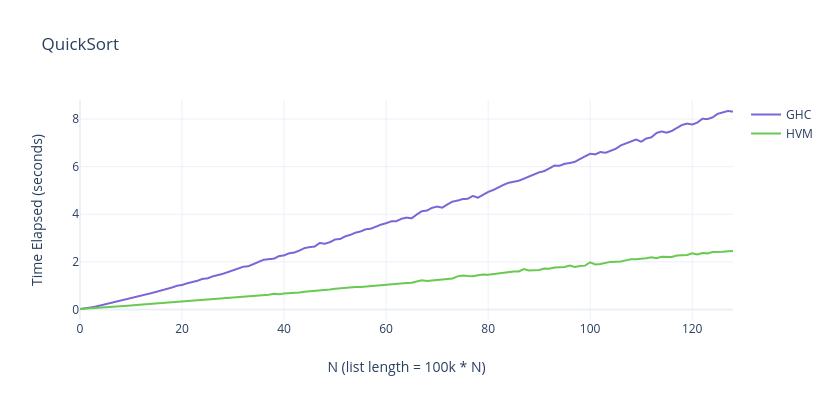
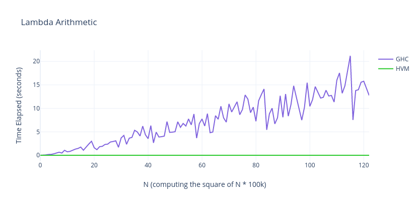

High-order Virtual Machine (HVM)
=================================

**High-order Virtual Machine (HVM)** is a pure functional compile target that
is **lazy**, **non-garbage-collected** and **massively parallel**. Not only
that, it is **beta-optimal**, which means that, in several cases, it can be
exponentially faster than most functional runtimes, including Haskell's GHC.

That is possible due to a new model of computation, the Interaction Net, which
combines the Turing Machine with the Lambda Calculus. Up until recently, that
model, despite elegant, was not efficient in practice. A recent breaktrough,
though, improved its efficiency drastically, giving birth to the HVM. Despite
being a prototype, it already beats mature compilers in many cases, and is set
to scale towards uncharted levels of performance.

**Welcome to the inevitable parallel, functional future of computers!**

Usage
-----

#### 1. Install it

First, install [Rust](https://www.rust-lang.org/). Then, type:

```bash
git clone git@github.com:Kindelia/HVM
cd HVM
cargo install --path .
```

#### 2. Create a HVM file

HVM files look like untyped Haskell. Save the file below as `main.hvm`:

```javascript
// Creates a tree with `2^n` elements
(Gen 0) = (Leaf 1)
(Gen n) = (Node (Gen(- n 1)) (Gen(- n 1)))

// Adds all elemements of a tree
(Sum (Leaf x))   = x
(Sum (Node a b)) = (+ (Sum a) (Sum b))

// Performs 2^30 additions in parallel
(Main n) = (Sum (Gen 30))
```

#### 3. Test it with the interpreter

```bash
hvm run main.hvm
```

#### 4. Compile it to blazingly fast, parallel C

```bash
hvm c main.hvm                     # compiles hvm to C
clang -O2 main.c -o main -lpthread # compiles C to executable
./main                             # runs the executable
```

The program above runs in about **6.4 seconds** in a modern 8-core processor,
while the identical Haskell code takes about **19.2 seconds** in the same
machine with GHC. Notice how there are no parallelism annotations! You write a
pure functional program, and the parallelism comes for free. And that's just the
tip of iceberg. 

Benchmarks
==========

HVM has two main advantages over GHC: beta-optimality and automatic parallelism.
As such, to compare them, I've selected 2 parallel benchmarks (simple and
complex), 2 optimal benchmarks (simple and complex) and 1 sequential benchmark.
Keep in mind HVM is still an early prototype, it **obviously** won't beat GHC in
general, but it does quite fine already, and should improve steadily as
optimizations are implemented. Tests were ran with `ghc -O2` for Haskell and
`clang -O2` for HVM, in an 8-core M1 Max processor.

List Fold (Sequential)
----------------------

<table>
<tr> <td>main.hvm</td> <td>main.hs</td> </tr>
<tr>
<td>

```javascript
// Folds over a list
(Fold Nil         c n) = n
(Fold (Cons x xs) c n) = (c x (Fold xs c n))

// A list from 0 to n
(Range 0 xs) = xs
(Range n xs) =
  let m = (- n 1)
  (Range m (Cons m xs))

// Sums a big list with fold
(Main n) =
  let size = (* n 1000000)
  let list = (Range size Nil)
  (Fold list λaλb(+ a b) 0)
```

</td>
<td>

```haskell
-- Folds over a list
fold :: List a -> (a -> r -> r) -> r -> r
fold Nil         c n = n
fold (Cons x xs) c n = c x (fold xs c n)

-- A list from 0 to n
range :: Word32 -> List Word32 -> List Word32
range 0 xs = xs
range n xs =
  let m = n - 1
  in range m (Cons m xs)

-- Sums a big list with fold
main :: IO ()
main = do
  n <- read.head <$> getArgs :: IO Word32
  let size = 1000000 * n
  let list = range size Nil
  print $ fold list (+) 0
```

</td>
</tr>
</table>


In this micro benchmark, we just build a very huge list of numbers, and fold
over it to add them all. Since lists are sequential, and since there are no
high-order lambdas, HVM doesn't have any technical advantage over GHC. Because
of that, both runtimes perform very similarly.

Tree Sum (Parallel)
-------------------

<table>
<tr> <td>main.hvm</td> <td>main.hs</td> </tr>
<tr>
<td>

```javascript
// Creates a tree with `2^n` elements
(Gen 0) = (Leaf 1)
(Gen n) = (Node (Gen(- n 1)) (Gen(- n 1)))

// Adds all elemements of a tree
(Sum (Leaf x))   = x
(Sum (Node a b)) = (+ (Sum a) (Sum b))

// Performs 2^n additions
(Main n) = (Sum (Gen n))
```

</td>
<td>

```haskell
import Data.Word
import System.Environment

-- A binary tree of uints
data Tree = Node Tree Tree | Leaf Word32

-- Creates a tree with 2^n elements
gen :: Word32 -> Tree
gen 0 = Leaf 1
gen n = Node (gen(n - 1)) (gen(n - 1))

-- Adds all elements of a tree
sun :: Tree -> Word32
sun (Leaf x)   = 1
sun (Node a b) = sun a + sun b

-- Performs 2^n additions
main = do
  n <- read.head <$> getArgs :: IO Word32
  print $ sun (gen n)
```

</td>
</tr>
</table>


TreeSum recursively builds and sums all elements of a perfect binary tree. HVM
outperforms Haskell by a wide margin, because this algorithm is embarassingly
parallel, allowing it to fully use all the 8 cores available.

QuickSort (Parallel?)
---------------------

<table>
<tr> <td>main.hvm</td> <td>main.hs</td> </tr>
<tr>
<td>

```javascript
(...)

// Parallel QuickSort
(Sort Nil)          = Empty
(Sort (Cons x Nil)) = (Single p)
(Sort (Cons x xs))  =
  (Split p (Cons p xs) Nil Nil)

// Splits list in two partitions
(Split p Nil min max) =
  let smin = (Sort min)
  let smax = (Sort max)
  (Concat smin smax)
(Split p (Cons x xs) min max) =
  (Place p (< p x) x xs min max)

// Sorts and sums n random numbers
(Main n) = (Sum (Sort (Randoms 1 n)))
```

</td>
<td>

```haskell
(...)

-- Parallel QuickSort
qsort :: List Word32 -> Tree Word32
qsort Nil          = Empty
qsort (Cons x Nil) = Single x
qsort (Cons p xs)  =
  split p (Cons p xs) Nil Nil

-- Splits list in two partitions
split p Nil min max =
  let smin = qsort min
      smax = qsort max
  in Concat smin smax
split p (Cons x xs) min max =
  place p (p < x) x xs min max

-- Sorts and sums n random numbers
main :: IO ()
main = do
  n <- read.head <$> getArgs :: IO Word32
  print $ sun $ qsort $ randoms 1 n
```

</td>
</tr>
</table>



This test once again takes advantage of automatic parallelism by modifying the
usual QuickSort implementation to return a concatenation tree instead of a flat
list. This, again, allows HVM to use multiple cores, but not fully, which is
why it doesn't significantly outperform GHC. I'm looking for alternative sorting
algorithms that make better use of HVM's implicit parallelism.

Composition (Optimal)
---------------------

<table>
<tr> <td>main.hvm</td> <td>main.hs</td> </tr>
<tr>
<td>

```javascript
// Computes f^(2^n)
(Comp 0 f x) = (f x)
(Comp n f x) = (Comp (- n 1) λk(f (f k)) x)

// Performs 2^n compositions
(Main n) = (Comp n λx(x) 0)
```

</td>
<td>

```haskell
import System.Environment

-- Computes f^(2^n)
comp :: Int -> (a -> a) -> a -> a
comp 0 f x = f x
comp n f x = comp (n - 1) (\x -> f (f x)) x

-- Performs 2^n compositions
main :: IO ()
main = do
  n <- read.head <$> getArgs :: IO Int
  print $ comp n (\x -> x) (0 :: Int)
```

</td>
</tr>
</table>


This chart isn't wrong: HVM is *exponentially* faster for function composition,
due to optimality, depending on the target function. There is no parallelism
involved here. In general, if the composition of a function `f` has a
constant-size normal form, then `f^(2^N)(x)` is constant-time (`O(N)`) on HVM,
and exponential-time (`O(2^N)`) on GHC. This can be taken advantage of to design
novel functional algorithms. I highly encourage you to try composing different
functions and watching how their complexity behaves. Can you tell if it will be
linear or exponential? How recursion affects it? That's a very insightful
experience!

Lambda Arithmetic (Optimal)
---------------------------

<table>
<tr> <td>main.hvm</td> <td>main.hs</td> </tr>
<tr>
<td>

```javascript
(...)

// Increments a Bits by 1
(Inc xs) = λex λox λix
  let e = ex
  let o = ix
  let i = λp (ox (Inc p))
  (xs e o i)

// Adds two Bits
(Add xs ys) = (App xs λx(Inc x) ys)

// Multiplies two Bits
(Mul xs ys) = 
  let e = End
  let o = λp (B0 (Mul p ys))
  let i = λp (Add ys (B0 (Mul p ys)))
  (xs e o i)

// Squares (n * 100k)
(Main n) =
  let a = (FromU32 32 (* 100000 n))
  let b = (FromU32 32 (* 100000 n))
  (ToU32 (Mul a b))
```

</td>
<td>

```haskell
(...)

-- Increments a Bits by 1
inc :: Bits -> Bits
inc xs = Bits $ \ex -> \ox -> \ix ->
  let e = ex
      o = ix
      i = \p -> ox (inc p)
  in get xs e o i

-- Adds two Bits
add :: Bits -> Bits -> Bits
add xs ys = app xs (\x -> inc x) ys

-- Muls two Bits
mul :: Bits -> Bits -> Bits
mul xs ys = 
  let e = end
      o = \p -> b0 (mul p ys)
      i = \p -> add ys (b1 (mul p ys))
  in get xs e o i

-- Squares (n * 100k)
main :: IO ()
main = do
  n <- read.head <$> getArgs :: IO Word32
  let a = fromU32 32 (100000 * n)
  let b = fromU32 32 (100000 * n)
  print $ toU32 (mul a b)
```

</td>
</tr>
</table>



This example takes advantage of beta-optimality to implement multiplication
using lambda-encoded bitstrings. Once again, HVM halts instantly, while GHC
struggles to deal with all these lambdas. Lambda encodings have wide practical
applications. For example, Haskell's Lists are optimized by converting them to
lambdas (foldr/build), its Free Monads library has a faster version based on
lambdas, and so on. HVM's optimality open doors for an entire unexplored field
of lambda encoded algorithms that were simply impossible before.

How is that possible?
=====================

Check [HOW.md](https://github.com/Kindelia/HVM/blob/master/HOW.md).

How can I help?
===============

Join us at the [Kindelia](https://discord.gg/QQ2jkxVj) community!
