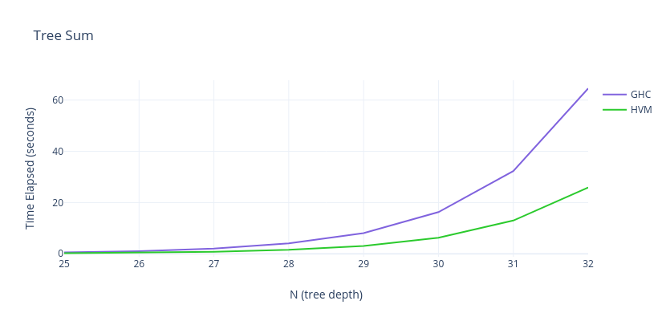
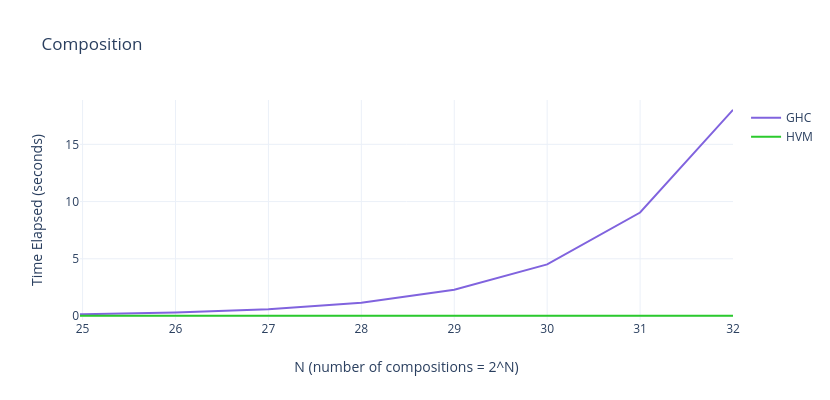

High-order Virtual Machine (HVM)
=================================

**High-order Virtual Machine (HVM)** is a pure functional compile target that
is **lazy**, **non-garbage-collected** and **massively parallel**. It is also
**beta-optimal**, meaning that, in several cases, it can be exponentially
faster than most functional runtimes, including Haskell's GHC.

That is possible due to a new model of computation, the Interaction Net, which
elegantly combines the Turing Machine with the Lambda Calculus. Previous
implementations of this model have been inefficient in practice, however, a
recent breakthrough has drastically improved its efficiency, giving birth to
the HVM. Despite being a prototype, it already beats mature compilers in many
cases, and is set to scale towards uncharted levels of performance.

**Welcome to the inevitable parallel, functional future of computers!**

Usage
-----

#### 1. Install it

First, install [Rust](https://www.rust-lang.org/). Then, type:

```bash
cargo install hvm
```

#### 2. Create an HVM file

HVM files look like untyped Haskell. Save the file below as `main.hvm`:

```javascript
// Creates a tree with `2^n` elements
(Gen 0) = (Leaf 1)
(Gen n) = (Node (Gen(- n 1)) (Gen(- n 1)))

// Adds all elements of a tree
(Sum (Leaf x))   = x
(Sum (Node a b)) = (+ (Sum a) (Sum b))

// Performs 2^n additions in parallel
(Main n) = (Sum (Gen n))
```

The program above creates a perfect binary tree with `2^n` elements and adds
them up. Since it is recursive, HVM will parallelize it automatically.

#### 3. Run and compile

```bash
hvm r main 10                      # runs it with n=10
hvm c main                         # compiles HVM to C
clang -O2 main.c -o main -lpthread # compiles C to BIN
./main 30                          # runs it with n=30
```

The program above runs in about **6.4 seconds** in a modern 8-core processor,
while the identical Haskell code takes about **19.2 seconds** in the same
machine with GHC. This is HVM: write a functional program, get a parallel C
runtime. And that's just the tip of iceberg!

#### For Nix users

[See Nix usage documentation here](./NIX.md).

Benchmarks
==========

HVM has two main advantages over GHC: automatic parallelism and beta-optimality.
I've selected 5 common micro-benchmarks to compare them. Keep in mind that HVM
is still an early prototype, so it **obviously** won't beat GHC in general, but
it does quite well already and should improve steadily as optimizations are
implemented. Tests were compiled with `ghc -O2` for Haskell and `clang -O2` for
HVM, on an 8-core M1 Max processor. The complete files to replicate these
results are in [the /bench directory](bench).

List Fold (Sequential)
----------------------

<table>
<tr>
  <td><a href="./bench/ListFold/main.hvm"> main.hvm </a></td>
  <td><a href="./bench/ListFold/main.hs" > main.hs </a></td>
</tr>
<tr>
<td>

```javascript
// Folds over a list
(Fold Nil         c n) = n
(Fold (Cons x xs) c n) = (c x (Fold xs c n))

// A list from 0 to n
(Range 0 xs) = xs
(Range n xs) =
  let m = (- n 1)
  (Range m (Cons m xs))

// Sums a big list with fold
(Main n) =
  let size = (* n 1000000)
  let list = (Range size Nil)
  (Fold list λaλb(+ a b) 0)
```

</td>
<td>

```haskell
-- Folds over a list
fold Nil         c n = n
fold (Cons x xs) c n = c x (fold xs c n)

-- A list from 0 to n
range 0 xs = xs
range n xs =
  let m = n - 1
  in range m (Cons m xs)

-- Sums a big list with fold
main = do
  n <- read.head <$> getArgs :: IO Word32
  let size = 1000000 * n
  let list = range size Nil
  print $ fold list (+) 0
```

</td>
</tr>
</table>


<sub> *the lower the better </sub>

In this micro-benchmark, we just build a huge list of numbers, and fold over
it to sum them. Since lists are sequential, and since there are no higher-order
lambdas, HVM doesn't have any technical advantage over GHC. As such, both
runtimes perform very similarly.

Tree Sum (Parallel)
-------------------

<table>
<tr>
  <td><a href="./bench/TreeSum/main.hvm"> main.hvm </a></td>
  <td><a href="./bench/TreeSum/main.hs" > main.hs </a></td>
</tr>
<tr>
<td>

```javascript
// Creates a tree with `2^n` elements
(Gen 0) = (Leaf 1)
(Gen n) = (Node (Gen(- n 1)) (Gen(- n 1)))

// Adds all elemements of a tree
(Sum (Leaf x))   = x
(Sum (Node a b)) = (+ (Sum a) (Sum b))

// Performs 2^n additions
(Main n) = (Sum (Gen n))
```

</td>
<td>

```haskell
-- Creates a tree with 2^n elements
gen 0 = Leaf 1
gen n = Node (gen(n - 1)) (gen(n - 1))

-- Adds all elements of a tree
sun (Leaf x)   = 1
sun (Node a b) = sun a + sun b

-- Performs 2^n additions
main = do
  n <- read.head <$> getArgs :: IO Word32
  print $ sun (gen n)
```

</td>
</tr>
</table>



TreeSum recursively builds and sums all elements of a perfect binary tree. HVM
outperforms Haskell by a wide margin because this algorithm is embarassingly
parallel, allowing it to fully use the available cores.

QuickSort (Parallel)
--------------------

<table>
<tr>
  <td><a href="./bench/QuickSort/main.hvm"> main.hvm </a></td>
  <td><a href="./bench/QuickSort/main.hs" > main.hs </a></td>
</tr>
<tr>
<td>

```javascript
// QuickSort
(QSort p s Nil)          = Empty
(QSort p s (Cons x Nil)) = (Single x)
(QSort p s (Cons x xs))  =
  (Split p s (Cons x xs) Nil Nil)

// Splits list in two partitions
(Split p s Nil min max) =
  let s   = (>> s 1)
  let min = (QSort (- p s) s min)
  let max = (QSort (+ p s) s max)
  (Concat min max)
(Split p s (Cons x xs) min max) =
  (Place p s (< p x) x xs min max)

// Sorts and sums n random numbers
(Main n) =
  let list = (Randoms 1 (* 100000 n))
  (Sum (QSort Pivot Pivot list))
```

</td>
<td>

```haskell
-- QuickSort
qsort p s Nil          = Empty
qsort p s (Cons x Nil) = Single x
qsort p s (Cons x xs)  =
  split p s (Cons x xs) Nil Nil

-- Splits list in two partitions
split p s Nil min max =
  let s'   = shiftR s 1
      min' = qsort (p - s') s' min
      max' = qsort (p + s') s' max
  in  Concat min' max'
split p s (Cons x xs) min max =
  place p s (p < x) x xs min max

-- Sorts and sums n random numbers
main = do
  n <- read.head <$> getArgs :: IO Word32
  let list = randoms 1 (100000 * n)
  print $ sun $ qsort pivot pivot $ list 
```

</td>
</tr>
</table>


This test modifies QuickSort to return a concatenation tree instead of a flat
list. This makes it embarassingly parallel, allowing HVM to outperform GHC by a
wide margin again. It even beats Haskell's sort from Data.List! Note that
flattening the tree will make the algorithm sequential. That's why we didn't
chose MergeSort, as `merge` operates on lists. In general, trees should be
favoured over lists on HVM.

Composition (Optimal)
---------------------

<table>
<tr>
  <td><a href="./bench/Composition/main.hvm"> main.hvm </a></td>
  <td><a href="./bench/Composition/main.hs" > main.hs </a></td>
</tr>
<tr>
<td>

```javascript
// Computes f^(2^n)
(Comp 0 f x) = (f x)
(Comp n f x) = (Comp (- n 1) λk(f (f k)) x)

// Performs 2^n compositions
(Main n) = (Comp n λx(x) 0)
```

</td>
<td>

```haskell
-- Computes f^(2^n)
comp 0 f x = f x
comp n f x = comp (n - 1) (\x -> f (f x)) x

-- Performs 2^n compositions
main = do
  n <- read.head <$> getArgs :: IO Int
  print $ comp n (\x -> x) (0 :: Int)
```

</td>
</tr>
</table>



This chart isn't wrong: HVM is *exponentially* faster for function composition,
due to optimality, depending on the target function. There is no parallelism
involved here. In general, if the composition of a function `f` has a
constant-size normal form, then `f^(2^N)(x)` is constant-time (`O(N)`) on HVM,
and exponential-time (`O(2^N)`) on GHC. This can be taken advantage of to design
novel functional algorithms. I highly encourage you to try composing different
functions and watching how their complexity behaves. Can you tell if it will be
linear or exponential? Or how recursion will affect it? That's a very
insightful experience!

Lambda Arithmetic (Optimal)
---------------------------

<table>
<tr>
  <td><a href="./bench/LambdaArithmetic/main.hvm"> main.hvm </a></td>
  <td><a href="./bench/LambdaArithmetic/main.hs" > main.hs </a></td>
</tr>
<tr>
<td>

```javascript
// Increments a Bits by 1
(Inc xs) = λex λox λix
  let e = ex
  let o = ix
  let i = λp (ox (Inc p))
  (xs e o i)

// Adds two Bits
(Add xs ys) = (App xs λx(Inc x) ys)

// Multiplies two Bits
(Mul xs ys) = 
  let e = End
  let o = λp (B0 (Mul p ys))
  let i = λp (Add ys (B0 (Mul p ys)))
  (xs e o i)

// Squares (n * 100k)
(Main n) =
  let a = (FromU32 32 (* 100000 n))
  let b = (FromU32 32 (* 100000 n))
  (ToU32 (Mul a b))
```

</td>
<td>

```haskell
-- Increments a Bits by 1
inc xs = Bits $ \ex -> \ox -> \ix ->
  let e = ex
      o = ix
      i = \p -> ox (inc p)
  in get xs e o i

-- Adds two Bits
add xs ys = app xs (\x -> inc x) ys

-- Multiplies two Bits
mul xs ys = 
  let e = end
      o = \p -> b0 (mul p ys)
      i = \p -> add ys (b1 (mul p ys))
  in get xs e o i

-- Squares (n * 100k)
main = do
  n <- read.head <$> getArgs :: IO Word32
  let a = fromU32 32 (100000 * n)
  let b = fromU32 32 (100000 * n)
  print $ toU32 (mul a b)
```

</td>
</tr>
</table>


This example takes advantage of beta-optimality to implement multiplication
using lambda-encoded bitstrings. Once again, HVM halts instantly, while GHC
struggles to deal with all these lambdas. Lambda encodings have wide practical
applications. For example, Haskell's Lists are optimized by converting them to
lambdas (foldr/build), its Free Monads library has a faster version based on
lambdas, and so on. HVM's optimality open doors for an entire unexplored field
of lambda-encoded algorithms that were simply impossible before.

*Charts made on [plotly.com](https://chart-studio.plotly.com/).*

How is that possible?
=====================

Check [HOW.md](HOW.md).

How can I help?
===============

Most importantly, if you appreciate our work, help spreading the project! Posting on
Reddit, communities, etc. helps more than you think.

Second, I'm actually looking for partners! I'm confident HVM's current design is ready
to scale and become the fastest runtime in the world. There are many cool things we'd
like to implement:

- Compile it to GPUs (just imagine that!)

- Build a blockchain around it (draft on [Kindelia](https://github.com/kindelia/kindelia))

- Compile [Kind-Lang](https://github.com/kindelia/kind) to it

- A bunch of other [planned features](https://github.com/Kindelia/HVM/issues/38)

If you'd like to be part of any of these, please
[email me](victor.taelin@gmail.com), or just send me a personal message on
[Twitter](https://twitter.com/victor.taelin).

Community
=========

To just follow the project, join our [Telegram
Chat](https://t.me/formality_lang), the [Kindelia community on
Discord](https://discord.gg/QQ2jkxVj) or
[Matrix](https://matrix.to/#/#kindelia:kde.org)!
